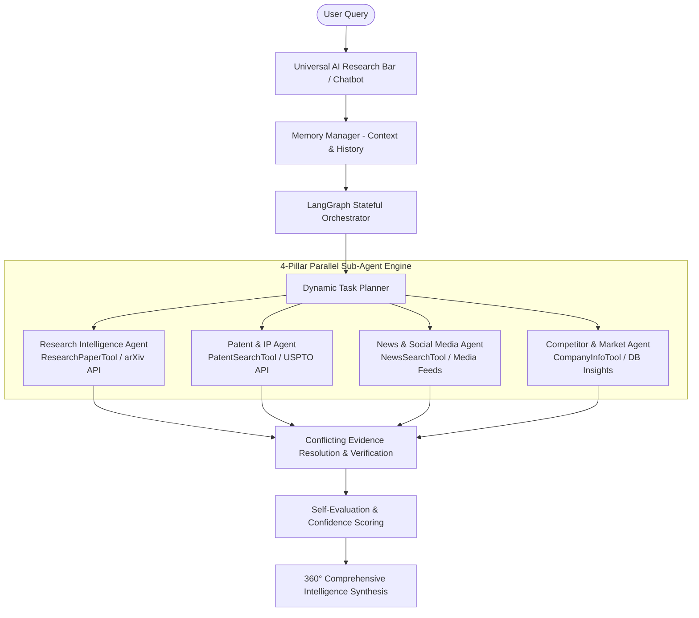

# CodeCrew5 AI — Enterprise AI Research & Competitive Intelligence Platform

[](https://opensource.org/licenses/MIT)
[](https://python.org)
[](https://react.dev)
[](https://groq.com)
[](https://github.com/gaurav4047/CodeCrew5-ai)

**CodeCrew5 AI** is an enterprise-grade, multi-agent AI research and competitive intelligence SaaS platform. It continuously ingests, cross-verifies, and synthesizes 360° intelligence across scientific research preprints, worldwide patent claims, competitor corporate filings, industry media feeds, and public social signals using **LangGraph stateful orchestration** and **Groq LPU LLM inference**.

---

## 🌟 Key Features & Capabilities

- 🤖 **LangGraph Stateful Orchestration**:
  - **Dynamic Task Planning**: Automatically decomposes complex queries into multi-agent execution sub-tasks.
  - **Parallel Sub-Agent Execution**: Deploys 4 specialized agents concurrently.
  - **API Fallback Recovery**: Recovers automatically from external data source latency spikes.
  - **Conflicting Evidence Resolution**: Cross-verifies corporate press claims against academic preprints.
  - **Self-Evaluation & Confidence Scoring**: Calculates confidence scores (e.g. `94.5%`) before final output approval.
- 🧠 **Context & Memory Engine**:
  - Short-term & persistent long-term memory retaining active topics, user context, and prior findings across multi-turn queries.
- 📊 **Curated Executive Command Center**:
  - Modular Widget Architecture (`WIDGET_REGISTRY`) with an **Executive Focus** default view and category tabs (`Market & Discovery`, `System & Telemetry`).
- 🌐 **Enterprise SaaS Interface (15 Routes)**:
  - 📊 **Dashboard** (`/dashboard`): Curated Executive Command Center overview.
  - 🔍 **AI Research Workspace** (`/research`): Universal AI Research Bar, execution events panel, and node graph topology.
  - 🔬 **Research Papers** (`/papers`): arXiv / PubMed preprints, citations, abstracts, and arXiv links.
  - 📜 **Patents** (`/patents`): USPTO / EPO claims, assignee tracking, and Google Patents links.
  - 🏢 **Competitors** (`/competitors`): Corporate profiles, products, tech stacks, market cap, and timeline moves.
  - 📰 **News Intelligence** (`/news`): Industry press feed with confidence scores and category tags.
  - 🌐 **Social Intelligence** (`/social`): Public community sentiment, mention curves, and **Fact vs Signal** indicators.
  - 📈 **Trend Radar** (`/trends`): Emerging (+142%), Growing (+88%), and Stable (+35%) tech trajectories.
  - 💡 **Insights** (`/insights`): Categorized findings (**`Verified Fact`** vs **`AI Inference`** vs **`Recommendation`**).
  - 🚨 **Priority Alerts** (`/alerts`): Critical, High, Medium severity alerts with mark read and dismissal controls.
  - 🎯 **Tracking Targets** (`/tracking`): Full CRUD management of automated monitoring targets.
  - 📄 **Reports & Export** (`/reports`): Executive summaries with PDF / CSV / JSON export engines.
  - 📑 **Collections** (`/collections`): Bookmarked research papers, priority patent claims, and saved items.
  - 🕸️ **Knowledge Graph** (`/graph`): Interactive SVG node topology graph connecting Companies, Tech, Papers, Patents, Products.
  - ⚙️ **Settings** (`/settings`): Resource awareness, Groq API telemetry, and platform status.

---

## 🛠️ Multi-Agent Architecture



---

## 🚀 Quick Start Guide

### Prerequisites
- **Python 3.11+**
- **Node.js 18+** / **npm 9+**
- **Groq API Key** (`gsk_...`)

### 1. Clone the Repository
```bash
git clone https://github.com/gaurav4047/CodeCrew5-ai.git
cd CodeCrew5-ai
```

### 2. Backend Setup
```bash
cd backend
python3 -m venv venv
source venv/bin/activate
pip install -r requirements.txt
```

Start the backend API server:
```bash
python3 simple_chat_backend.py
```
*The backend API server will start on `http://localhost:8000`.*

### 3. Frontend Setup
In a new terminal window:
```bash
cd frontend
npm install
npm run dev
```
*The frontend application will start on `http://localhost:3001` or `http://localhost:3000`.*

---

## 🛰️ Key REST API Endpoints

| Method | Endpoint | Description |
| :--- | :--- | :--- |
| `POST` | `/api/chat` | Main multi-agent research endpoint executing LangGraph orchestration & memory context. |
| `GET` | `/api/dashboard/summary` | Real-time command center metrics across all 16 platform categories. |
| `GET` | `/api/insights/` | Retrieves all categorized insights with filter params (`unread_only`, `priority`). |
| `GET` | `/api/insights/stats/summary` | Returns insight statistics (total, unread, recent, high priority). |
| `GET` | `/api/tracking/` | Retrieves active automated tracking target configurations. |
| `POST` | `/api/tracking/` | Creates a new tracking target configuration. |
| `PUT` | `/api/tracking/{id}` | Updates an existing tracking target configuration or toggles active status. |
| `DELETE` | `/api/tracking/{id}` | Deletes a tracking target configuration. |
| `GET` | `/api/models` | Lists active LLM models (Groq API `groq/compound`, `llama-3.3-70b-versatile`). |

---

## 🧪 Testing & Building

### Frontend TypeScript Compilation & Bundling
```bash
cd frontend
npm run build
```

### Backend API Status Check
```bash
curl -X GET http://localhost:8000/api/dashboard/summary
```

---

## 📄 License

This project is licensed under the MIT License — see the [LICENSE](LICENSE) file for details.
