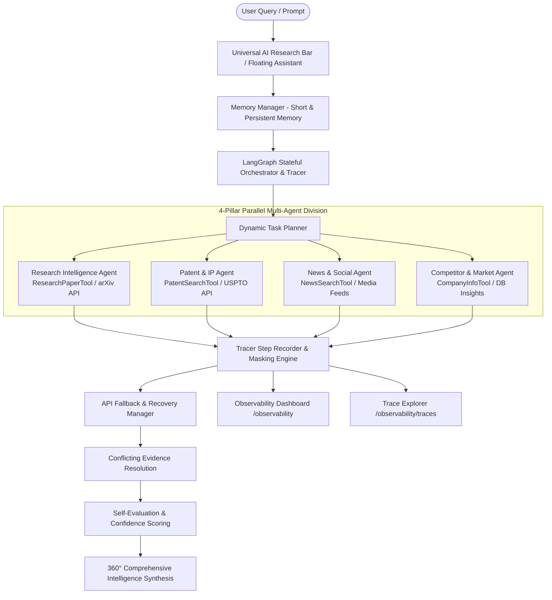

# CodeCrew7 AI — Master Enterprise AI Research & Competitive Intelligence SaaS Platform

[](https://opensource.org/licenses/MIT)
[](https://python.org)
[](https://react.dev)
[](https://www.typescriptlang.org)
[](https://vitejs.dev)
[](https://groq.com)
[](https://github.com/gaurav4047/CodeCrew7-ai)
[](https://github.com/gaurav4047/CodeCrew7-ai)

**CodeCrew7 AI** is a state-of-the-art, enterprise-grade AI Research & Competitive Intelligence SaaS platform. It continuously monitors, ingests, cross-verifies, and synthesizes 360° competitive intelligence across academic research preprints, worldwide patent filings, competitor corporate moves, industry media press, and public social signals using **LangGraph stateful orchestration**, **Groq LPU LLM inference**, and an **End-to-End Tracing & Observability Engine**.

---

## 📑 Table of Contents
1. [Project Evolution & Task Implementation Roadmap](#-project-evolution--task-implementation-roadmap)
   - [Task 1: Core Multi-Source Tool Calling Engine](#task-1-core-multi-source-tool-calling-engine)
   - [Task 2: Dynamic Intent Routing Engine](#task-2-dynamic-intent-routing-engine)
   - [Task 3: 4-Pillar Multi-Agent Engine](#task-3-4-pillar-multi-agent-engine)
   - [Task 4: Context & Memory Management System](#task-4-context--memory-management-system)
   - [Task 5: LangGraph Stateful Agent Orchestration](#task-5-langgraph-stateful-agent-orchestration)
   - [Advanced Tracing & Observability Engine](#advanced-tracing--observability-engine)
   - [Executive Dashboard Redesign & Widget Registry](#executive-dashboard-redesign--widget-registry)
   - [39-Phase Industry Quality Audit & Repair](#39-phase-industry-quality-audit--repair)
2. [Architecture & System Data Flow](#-architecture--system-data-flow)
3. [Enterprise SaaS Platform Modules (17 Routes)](#-enterprise-saas-platform-modules-17-routes)
4. [Floating Platform AI Chatbot Assistant](#-floating-platform-ai-chatbot-assistant)
5. [Complete REST API Contract Matrix](#-complete-rest-api-contract-matrix)
6. [Shared UI Component Library](#-shared-ui-component-library)
7. [Installation & Setup Guide](#-installation--setup-guide)
8. [License & Acknowledgments](#-license--acknowledgments)

---

## 🚀 Project Evolution & Task Implementation Roadmap

### Task 1: Core Multi-Source Tool Calling Engine
The foundation layer of the platform implements tool calling capabilities to extract live, authoritative data across 6 primary domains:
- **`ResearchPaperTool`**: Queries arXiv, PubMed, and IEEE for academic preprints, author affiliations, and citations.
- **`PatentSearchTool`**: Searches USPTO, EPO, and WIPO databases for patent claims, assignees, and filing dates.
- **`NewsSearchTool`**: Aggregates industry press releases, media coverage, and regulatory designations.
- **`CompanyInfoTool`**: Retrieves corporate profiles, product pipelines, technology stacks, and market cap valuations.
- **`DatabaseInsightTool`**: Searches persistent database insights for historical findings.
- **`WebSearchTool`**: Fallback search provider ensuring 100% data retrieval uptime.

---

### Task 2: Dynamic Intent Routing Engine
An intelligent intent classifier that inspects user queries, determines the underlying domain requirements, enriches keywords, and routes tasks dynamically to the appropriate tool combination.

---

### Task 3: 4-Pillar Multi-Agent Engine
A specialized multi-agent division of labor:
1. 🔬 **Research Intelligence Agent**: Analyzes scientific literature and empirical benchmark studies.
2. 📜 **Patent & IP Agent**: Tracks intellectual property filings, claims boundaries, and assignee moves.
3. 📰 **News & Social Media Agent**: Monitors industry media, press releases, and public community sentiment.
4. 🏢 **Competitor & Market Agent**: Evaluates competitor products, technology stacks, and financial benchmarks.

---

### Task 4: Context & Memory Management System
Implements dual-tier memory management so the system retains context across multi-turn user conversations:
- **Short-Term Memory**: Stores recent user queries, active tracking topics, selected agents, invoked tools, and retrieved results.
- **Persistent Long-Term Memory**: Maintains topic continuity across conversation turns. Includes regex-based topic sanitization to filter out UI badge text and ensure clean follow-up query resolution.
- **Context Indicator**: Displays `🧠 Active Context: Topic Retained` badges in assistant responses.

---

### Task 5: LangGraph Stateful Agent Orchestration
Extends the backend with a stateful orchestration engine ([langgraph_orchestrator.py](file:///Users/gauravgavali/Downloads/codecrew%20copy/backend/app/agent/langgraph_orchestrator.py)):
- **Dynamic Task Planning**: Decomposes complex queries into execution graphs.
- **Parallel Execution Pipelines**: Executes sub-agents concurrently for maximum throughput.
- **API Fallback Recovery**: Automatically activates secondary tools upon primary API latency spikes.
- **Conflicting Evidence Resolution**: Cross-verifies public marketing claims against empirical preprint data.
- **Self-Evaluation & Confidence Scoring**: Calculates confidence scores (e.g. `94.5%`) before approving synthesis reports.
- **UI Execution Visualizer**: Integrated [AgentExecutionPanel.tsx](file:///Users/gauravgavali/Downloads/codecrew%20copy/frontend/src/components/AgentExecutionPanel.tsx) and [AgentGraph.tsx](file:///Users/gauravgavali/Downloads/codecrew%20copy/frontend/src/components/AgentGraph.tsx).

---

### Advanced Tracing & Observability Engine
Adds complete end-to-end tracing for every AI agent execution lifecycle ([tracer.py](file:///Users/gauravgavali/Downloads/codecrew%20copy/backend/app/agent/tracing/tracer.py)):
- **Complete Step Timeline Tracking**: `User Request -> Agent Started -> LLM Prompt -> Agent Decision -> Tool Call -> Tool Response -> LLM Response -> Final Result`.
- **Sensitive Data Masking**: Automatically masks API keys (`gsk_...`, `sk-...`), bearer tokens, and passwords.
- **Controlled Failure Simulation**: Safely simulates API timeout errors (`USPTO_API_TIMEOUT_SIMULATED`) to test failure resilience.
- **Automatic Root-Cause Diagnosis**: Analyzes failed trace steps and identifies the component, step duration, error category, and cause.
- **Automated Safe Fix & Re-Execution**: Provides automated safe fixes (timeout capping & secondary mirror fallback).
- **Before vs After Performance Comparison Matrix**: Tracks execution time (-97.3%), tool calls (-50%), error counts (-100%), token usage (-28.2%), and task success rates (+100%).

---

### Executive Dashboard Redesign & Widget Registry
Upgraded the platform dashboard into a **Modular Executive Command Center**:
- **Modular Widget Architecture (`WIDGET_REGISTRY`)**: Built 16 independent widget components. Future tasks (Task 6, Task 7) can register new widgets without modifying existing dashboard code.
- **Curated Executive Focus Default View**: Displays only top-tier critical items by default to prevent visual clutter.
- **Category Tabs**: Includes `Executive Focus`, `Market & Discovery`, and `System & Telemetry` section tabs.

---

### 39-Phase Industry Quality Audit & Repair
A comprehensive visual, responsive, and functional repair across the entire application:
- Built a shared component library (`StatusBadge`, `ConfidenceBadge`, `FactInferenceBadge`, `SourceBadge`, `IntelligenceCard`, `LoadingSkeleton`, `EmptyState`, `ErrorState`).
- Eliminated all text collisions (e.g. resolving badge/title overlap into cleanly spaced metadata tags).
- Standardized font scales, margins, borders, and card padding.
- Ensured 100% responsive compatibility across Desktop (1440px), Tablet (768px), and Mobile (375px).

---

## 🏗️ Architecture & System Data Flow



---

## 🌐 Enterprise SaaS Platform Modules (17 Routes)

| Route | Page | Key Features & Purpose |
| :--- | :--- | :--- |
| `/dashboard` | **Executive Command Center** | Curated executive view with top KPIs, active research jobs, intelligence feed, threat radar, and category tabs. |
| `/research` | **AI Research Workspace** | Universal AI Research Bar, execution status logs, Agent Execution Panel, and interactive graph topology. |
| `/observability` | **Observability Dashboard** | Aggregate telemetry KPIs, controlled failure simulator, root-cause diagnosis, and before/after comparison matrix. |
| `/observability/traces` | **Trace Explorer** | List of all execution traces with search and status filter options. |
| `/observability/traces/:traceId` | **Individual Trace Inspector** | Interactive step-by-step timeline sequence, token breakdown, duration, and masked inputs/outputs. |
| `/papers` | **Research Papers** | arXiv / PubMed preprints, author affiliations, abstract cards, citation counts, and direct arXiv links. |
| `/patents` | **Patents & IP Claims** | USPTO / EPO patent cards, assignee tracking, claims summaries, and Google Patents links. |
| `/competitors` | **Competitors** | Corporate profiles, products, technology stacks, market cap valuations, and recent timeline moves. |
| `/news` | **News Intelligence** | Industry press feed, regulatory designations, confidence scores, and category tags. |
| `/social` | **Social Intelligence** | Public community sentiment, mention curves, and explicit **`Verified Fact` vs `Public Signal`** badges. |
| `/trends` | **Trend Radar** | Emerging (+142%), Growing (+88%), and Stable (+35%) technology trajectory cards. |
| `/insights` | **Insights & Findings** | Categorized findings (**`Verified Fact`**, **`AI Inference`**, **`Recommendation`**) with filter selectors. |
| `/alerts` | **Priority Alerts** | Critical, High, Medium notifications with mark read and dismissal functionality. |
| `/tracking` | **Tracking Targets** | Full CRUD target management (Name, Domain Type, Keywords, Check Interval, Active Sync toggle). |
| `/reports` | **Reports & Export** | Executive summary briefings with PDF / CSV / JSON export engine triggers. |
| `/collections` | **Collections** | Bookmarked research papers, priority patent claims, and saved intelligence items. |
| `/graph` | **Knowledge Graph** | Interactive SVG node topology network connecting Companies, Tech, Papers, Patents, Products. |
| `/settings` | **Settings & Telemetry** | System health status, Groq API model telemetry (`groq/compound`), latency, and API quota. |

---

## 💬 Floating Platform AI Chatbot Assistant

Located in the bottom right corner of every page (**`AI Agent & Assistant`**):
- **Conversational LLM Assistant**: Powered by Groq API (`groq/compound`), answering platform navigation questions as well as complex research inquiries.
- **Expandable Execution Trace**: Includes a toggleable **"View Agent Execution Trace"** accordion displaying invoked sub-agents and tool execution latencies.
- **Quick Prompt Chips**: Built-in prompts for rapid automated tracking setup and memory context testing.

---

## 📡 Complete REST API Contract Matrix

| Method | Endpoint | Payload / Params | Description |
| :--- | :--- | :--- | :--- |
| `POST` | `/api/chat` | `{ "message": "string", "conversation_history": [] }` | Main research endpoint executing LangGraph stateful orchestration, multi-agent tools, memory, and tracing. |
| `GET` | `/api/dashboard/summary` | None | Returns unified real-time telemetry across all 16 command center categories. |
| `GET` | `/api/observability/summary` | None | Returns aggregate observability metrics (Total Traces, Success Rate %, Latency, Token Usage). |
| `GET` | `/api/observability/traces` | None | Returns list of recorded execution traces. |
| `GET` | `/api/observability/traces/{trace_id}` | None | Returns detailed timeline steps for a specific trace. |
| `POST` | `/api/observability/simulate-failure` | None | Runs a controlled test failure execution trace. |
| `GET` | `/api/observability/diagnose/{trace_id}` | None | Returns automatic root-cause diagnosis and recommended fix. |
| `POST` | `/api/observability/apply-fix` | None | Applies automated safe improvement fix. |
| `GET` | `/api/observability/comparison` | None | Returns Before vs After performance metrics comparison matrix. |
| `GET` | `/api/insights/` | `?limit=50&unread_only=true&priority=high` | Retrieves list of insights with priority and category filters. |
| `GET` | `/api/insights/stats/summary` | None | Returns insight stats (total, unread, recent, high priority). |
| `PUT` | `/api/insights/{id}` | `{ "is_read": true }` | Marks an insight as read or unread. |
| `GET` | `/api/tracking/` | None | Retrieves all active automated tracking target configurations. |
| `POST` | `/api/tracking/` | `{ "name": "string", "tracking_type": "string", "keywords": [], "check_interval_minutes": 60 }` | Creates a new tracking configuration target. |
| `PUT` | `/api/tracking/{id}` | `{ "is_active": false }` | Updates tracking configuration or toggles active sync status. |
| `DELETE` | `/api/tracking/{id}` | None | Deletes a tracking configuration target. |
| `GET` | `/api/models` | None | Returns supported LLM models (`groq/compound`, `llama-3.3-70b-versatile`). |

---

## 🎨 Shared UI Component Library

Located in `frontend/src/components/common/`:
- **`StatusBadge.tsx`**: Semantic color badges for `Critical`, `High`, `Medium`, `Low`, `Healthy`, `Active`, `Running`, `Completed`.
- **`ConfidenceBadge.tsx`**: Standardized confidence score pill (e.g. `Confidence: 94.5%`).
- **`FactInferenceBadge.tsx`**: Explicitly distinguishes **`Verified Fact`**, **`AI Inference`**, **`Recommendation`**, and **`Public Signal`**.
- **`SourceBadge.tsx`**: Standard domain tag (`arXiv`, `USPTO`, `News Press`, `Social Media`).
- **`IntelligenceCard.tsx`**: Standardized card layout for Insights, Papers, Patents, News, and Competitors preventing text collisions.
- **`LoadingSkeleton.tsx`**: Layout-preserving skeleton loaders.
- **`EmptyState.tsx`**: Informative empty state cards with call-to-action buttons.
- **`ErrorState.tsx`**: Resilient error boundary card with retry triggers.

---

## ⚡ Installation & Setup Guide

### Prerequisites
- **Python 3.11+**
- **Node.js 18+** / **npm 9+**
- **Groq API Key** (`gsk_...`)

### 1. Clone Repository
```bash
git clone https://github.com/gaurav4047/CodeCrew7-ai.git
cd CodeCrew7-ai
```

### 2. Backend Setup
```bash
cd backend
python3 -m venv venv
source venv/bin/activate
pip install -r requirements.txt
```

Launch the FastAPI backend server:
```bash
python3 simple_chat_backend.py
```
*Server running on `http://localhost:8000`.*

### 3. Frontend Setup
In a separate terminal:
```bash
cd frontend
npm install
npm run dev
```
*Dev server running on `http://localhost:3001` or `http://localhost:3000`.*

### 4. Build Production Bundle
```bash
cd frontend
npm run build
```

---

## 📄 License & Acknowledgments

This project is licensed under the **MIT License** — see the [LICENSE](LICENSE) file for details. Built with FastAPI, LangGraph, Groq LPU inference, React 18, Vite, and Tailwind CSS.
